<p align="center">
  
</p>

<p align="center">
  <a href="https://github.com/luucabg/visual-web-skill/actions/workflows/verify.yml"></a>
  
  
  
</p>

<h1 align="center">De una idea a una web con criterio visual</h1>

<p align="center">
  <strong>Visual Web</strong> es una skill para Codex que estudia referencias reales, crea una dirección de arte propia, genera un diseño por sección y lo convierte en una web funcional.
</p>

## ¿Qué hace por ti?

| 1 · Encuentra | 2 · Diseña | 3 · Construye | 4 · Comprueba |
| --- | --- | --- | --- |
| Busca las referencias adecuadas para tu negocio. | Genera una propuesta original para cada sección. | Separa fotos y elementos para construirlos de verdad. | Revisa escritorio, móvil, movimiento y funciones. |

La IA **abre las capturas** antes de tomar decisiones. Cada elección queda registrada como:

> fuente → rasgo observado → adaptación propia → motivo

No entrena el modelo ni copia una web completa. Le proporciona memoria visual organizada y un método para razonar sobre ella.

## Pruébala con un solo mensaje

Después de instalarla, abre una tarea nueva en Codex y pega algo parecido a esto:

```text
Usa $visual-web para crear una landing de 8 secciones para un estudio de
arquitectura residencial. La audiencia son personas que quieren reformar su
vivienda. La acción principal es solicitar una primera conversación.

Quiero una estética cálida, precisa y tranquila. Selecciona y abre referencias
reales de la biblioteca, desarrolla una identidad propia, genera un diseño
independiente por sección y después sus activos. Implementa y comprueba la web
en escritorio y móvil. No inventes proyectos, clientes ni premios.
```

Puedes cambiar el negocio, el público, el número de secciones y el tono. También puedes pedir solo un hero, una dirección visual o una investigación de referencias.

## Instalación sencilla en Windows

1. En GitHub, pulsa **Code → Download ZIP** y descomprime la carpeta.
2. Abre esa carpeta, haz clic derecho en un espacio vacío y elige **Abrir en Terminal**.
3. Copia y pega:

```powershell
powershell -ExecutionPolicy Bypass -File .\install.ps1
```

Cuando aparezca `Installed and hash-verified`, abre una tarea nueva de Codex y usa `$visual-web`. El instalador comprueba todos los archivos y conserva una copia segura si estás actualizando una versión anterior.

<details>
<summary><strong>Instalar con Git</strong></summary>

```powershell
git clone https://github.com/luucabg/visual-web-skill.git
cd visual-web-skill
.\install.ps1
```

</details>

<details>
<summary><strong>macOS o Linux</strong></summary>

Copia la carpeta `skill/visual-web` dentro de `~/.codex/skills/visual-web` y abre una tarea nueva. Las instrucciones son portables; el instalador automático incluido está pensado para PowerShell en Windows.

</details>

## Tres resultados creados con la misma skill

| ARCO · Arquitectura | PULSO · Instrumento | MESA · Talleres |
| --- | --- | --- |
| [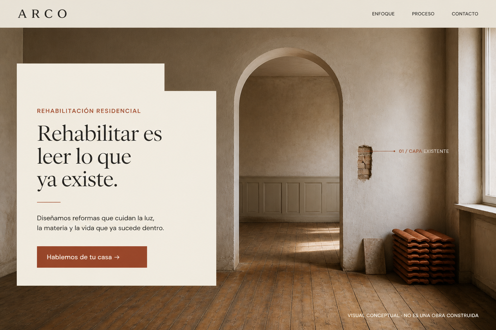](evaluation/architecture/review.md) | [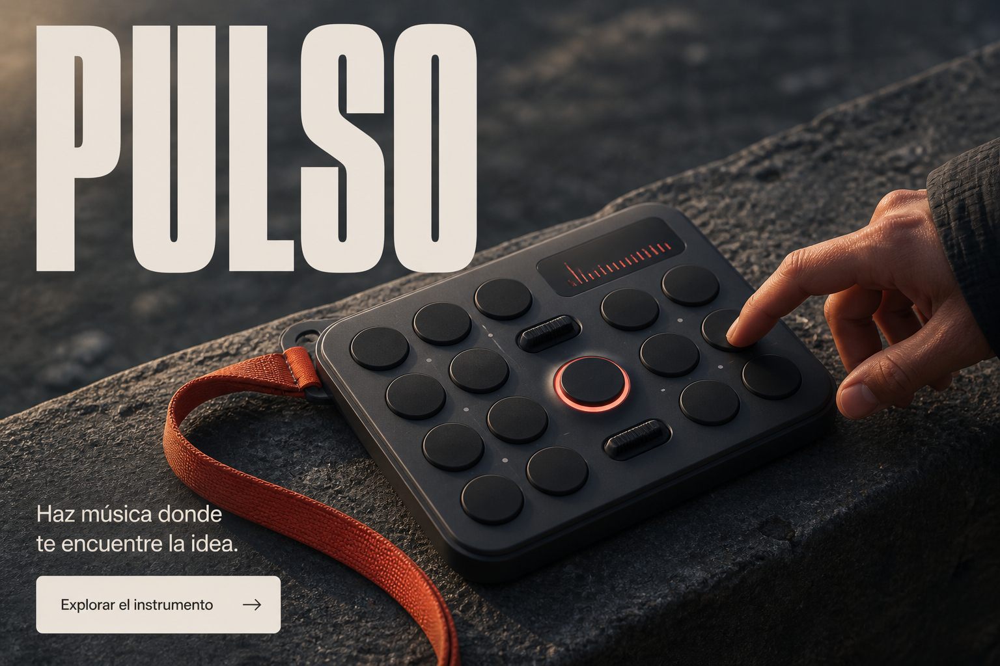](evaluation/instrument/review.md) | [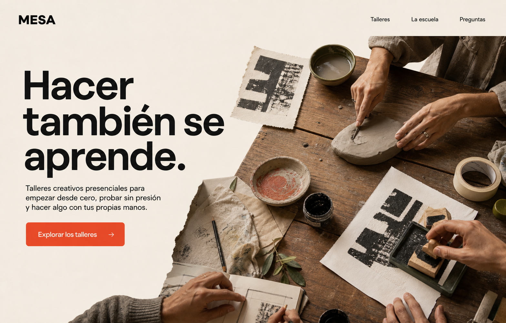](evaluation/school/review.md) |
| Rehabilitación calmada y material | Producto táctil y expresivo | Aprendizaje creativo y cercano |

[Ver selecciones, prompts exactos y revisiones →](evaluation/RESULTS.md)

Estos heroes son composiciones conceptuales generadas, no tres webs publicadas. En una implementación real, la skill reconstruye texto y controles en código y produce los activos necesarios por separado.

## La biblioteca visual

La primera edición contiene **48 capturas reales** —escritorio, secciones interiores y móvil— de 12 referencias:

`Lando Norris` · `MindMarket` · `Oryzo` · `Floema` · `Mistral` · `Shopify Editions` · `Linear` · `Teenage Engineering` · `Koto` · `Locomotive` · `Basement` · `Norm Architects`

### Las referencias reales, a la vista

| Lando Norris | MindMarket | Oryzo |
| --- | --- | --- |
| [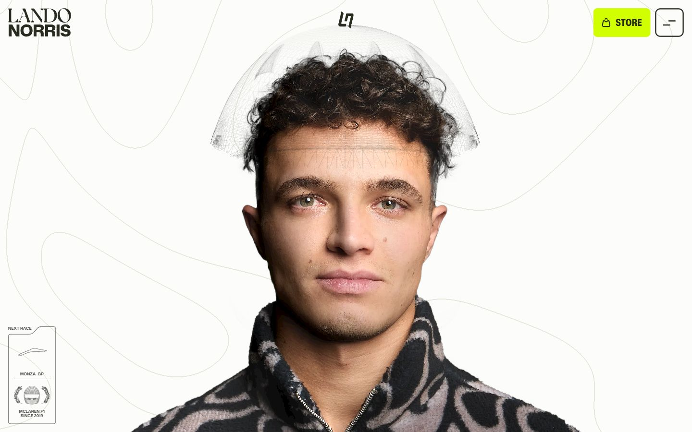](skill/visual-web/references/sites/landonorris/analysis.md) | [](skill/visual-web/references/sites/mindmarket/analysis.md) | [](skill/visual-web/references/sites/oryzo/analysis.md) |

| Floema | Mistral | Shopify Editions |
| --- | --- | --- |
| [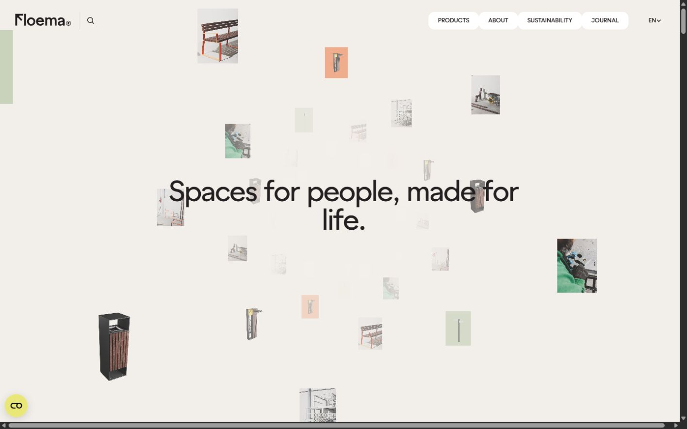](skill/visual-web/references/sites/floema/analysis.md) | [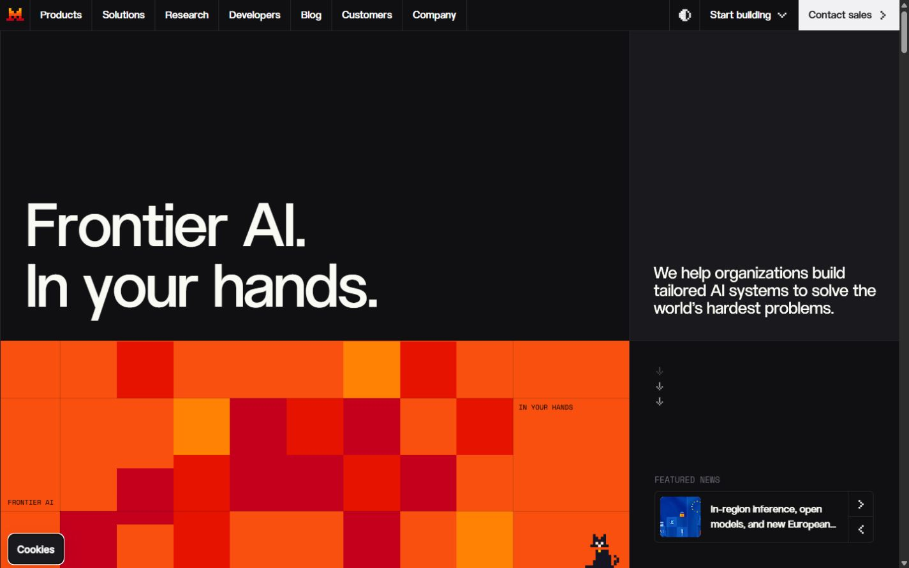](skill/visual-web/references/sites/mistral/analysis.md) | [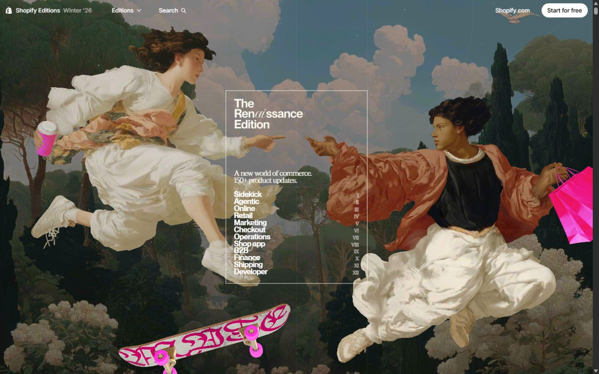](skill/visual-web/references/sites/shopify-editions/analysis.md) |

| Linear | Teenage Engineering | Koto |
| --- | --- | --- |
| [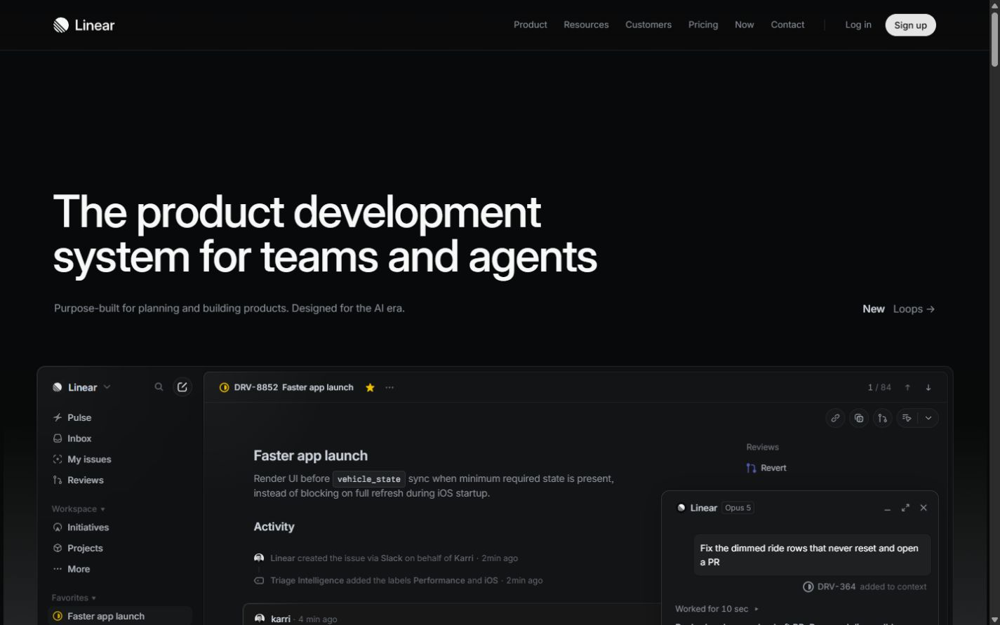](skill/visual-web/references/sites/linear/analysis.md) | [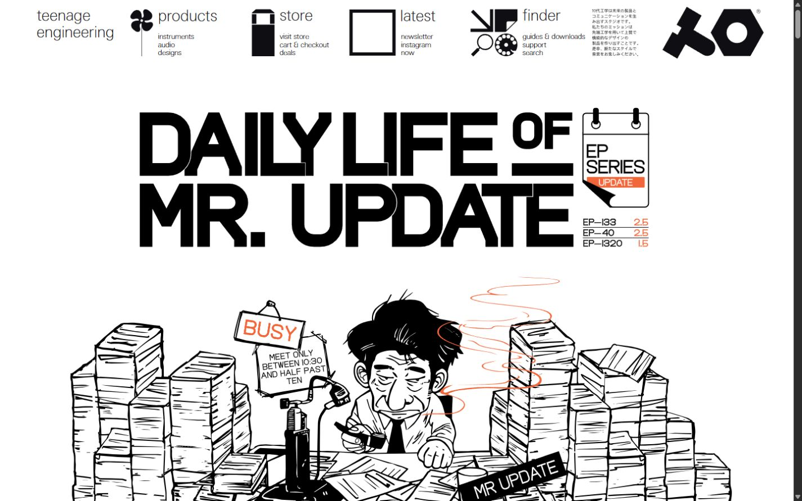](skill/visual-web/references/sites/teenage-engineering/analysis.md) | [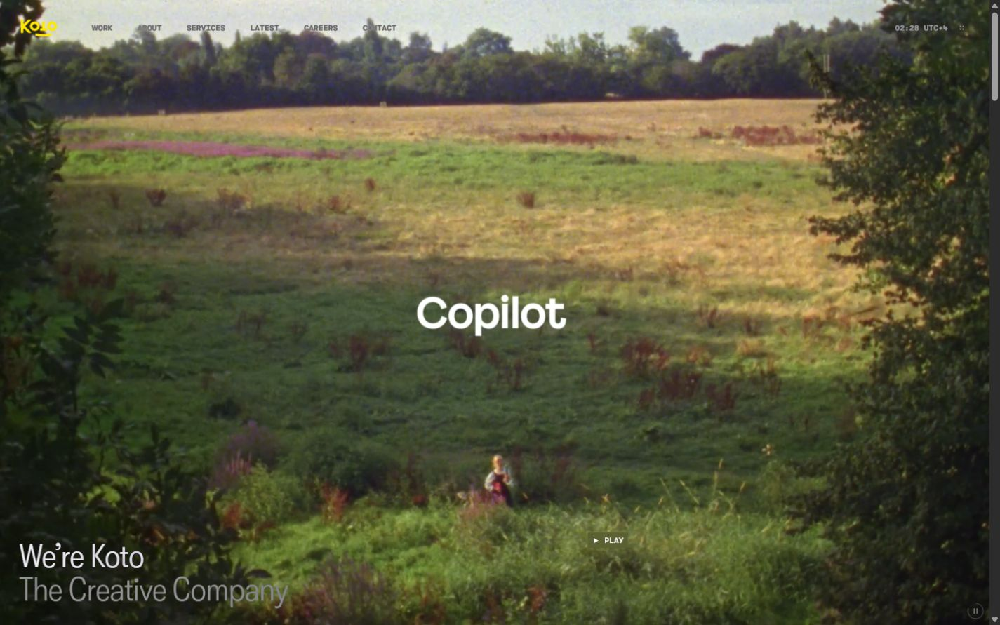](skill/visual-web/references/sites/koto/analysis.md) |

| Locomotive | Basement | Norm Architects |
| --- | --- | --- |
| [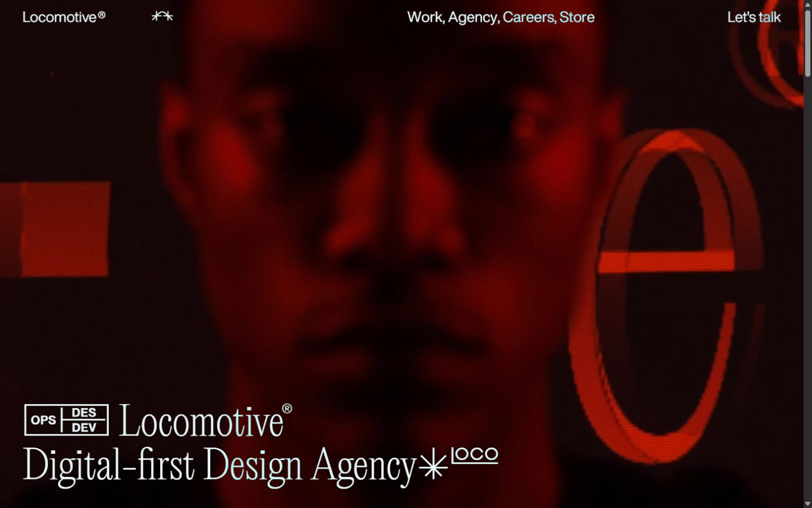](skill/visual-web/references/sites/locomotive/analysis.md) | [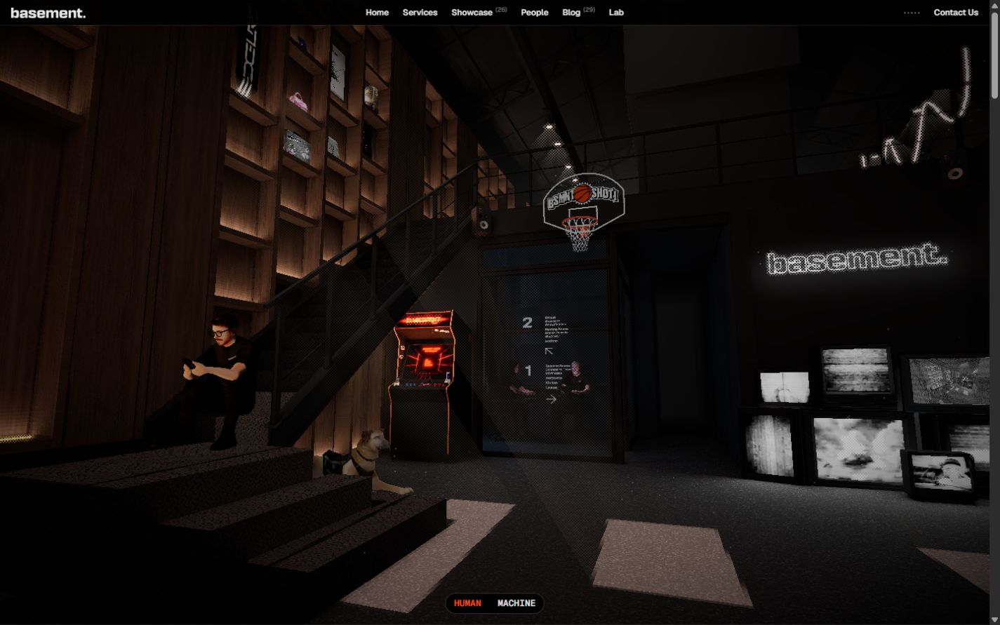](skill/visual-web/references/sites/basement/analysis.md) | [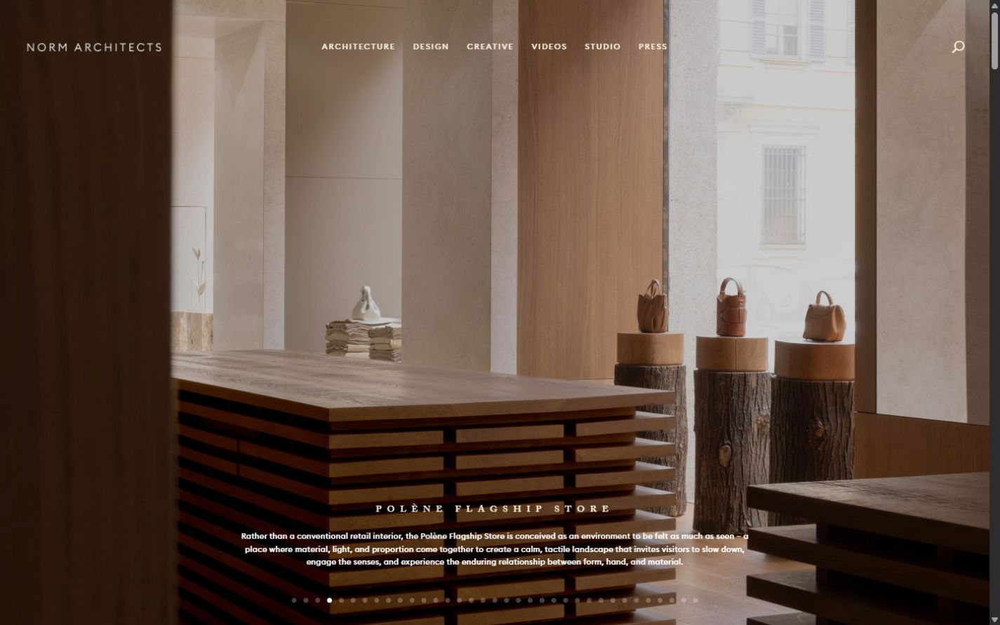](skill/visual-web/references/sites/norm-architects/analysis.md) |

Pulsa cualquier imagen para abrir su análisis. En cada ficha hay cuatro capturas: **portada de escritorio, dos secciones interiores y portada móvil**. La IA no se limita a esta galería: la skill le obliga a buscar, abrir a tamaño legible las capturas concretas que encajan con el encargo y leer después sus análisis.

Cada web incluye:

- capturas originales y fecha de observación;
- procedencia, viewport y posición de scroll;
- análisis visual legible y datos JSON para la IA;
- decisiones transferibles, límites y rasgos que debe evitar copiar;
- estado de movimiento marcado como observado o no probado.

[Explorar las 48 capturas en el índice visual →](skill/visual-web/references/INDEX.md)

## Qué contiene

```text
visual-web-skill/
├── skill/visual-web/        ← la skill instalable
│   ├── SKILL.md             ← método principal
│   ├── agents/openai.yaml   ← presentación en Codex
│   ├── references/          ← capturas, catálogo y guías
│   └── scripts/             ← búsqueda y validación
├── evaluation/              ← tres pruebas visuales independientes
├── tests/                   ← pruebas de integridad y seguridad
├── install.ps1              ← instalación verificada por hash
└── NOTICES.md               ← procedencia y límites de uso
```

La carpeta `skill/visual-web` es autocontenida. El buscador funciona desde cualquier directorio y devuelve las imágenes concretas que la IA debe abrir.

## Para ampliar la colección

El [protocolo de captura](skill/visual-web/references/capture-protocol.md) explica cómo añadir una web sin inventar datos ni guardar pantallas de error. Después:

```powershell
node scripts/rebuild-catalog.mjs
node scripts/check-package.mjs
node skill/visual-web/scripts/validate.mjs
.\install.ps1 -Force
```

`rebuild-catalog` mide los archivos y relaciona cada captura por ID. Nunca genera observaciones visuales automáticamente.

## Verificación

```powershell
node --test tests/tooling.test.mjs tests/maintenance.test.mjs
node scripts/check-package.mjs
node scripts/check-evaluations.mjs
node scripts/check-release.mjs
```

La suite comprueba imágenes JPEG/PNG reales, rutas seguras, catálogo, búsqueda bilingüe, instalación con backup, enlaces, caso OFFGRID y las tres evaluaciones. GitHub Actions repite estas comprobaciones en cada cambio.

## Uso responsable

Las capturas muestran diseños, marcas, fotografías y textos de sus respectivos titulares. Se conservan como referencias privadas de estudio y **no son activos para copiar o reutilizar**. Los diseños nuevos deben desarrollar su propia identidad y usar contenido autorizado. Consulta [procedencia y límites](NOTICES.md) y la [licencia](LICENSE.md).

Visual Web ayuda a diseñar y verificar mejor; no garantiza premios ni sustituye contenido real, accesibilidad, buen desarrollo o revisión humana.
