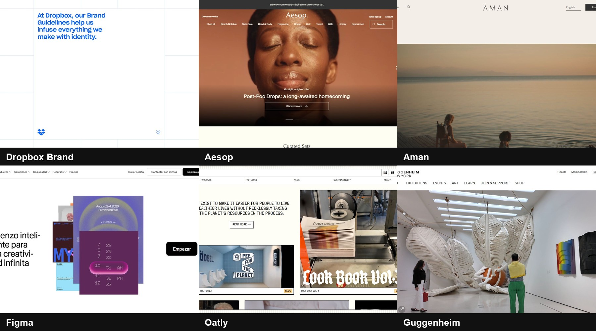
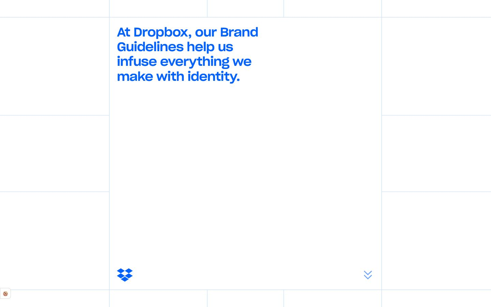
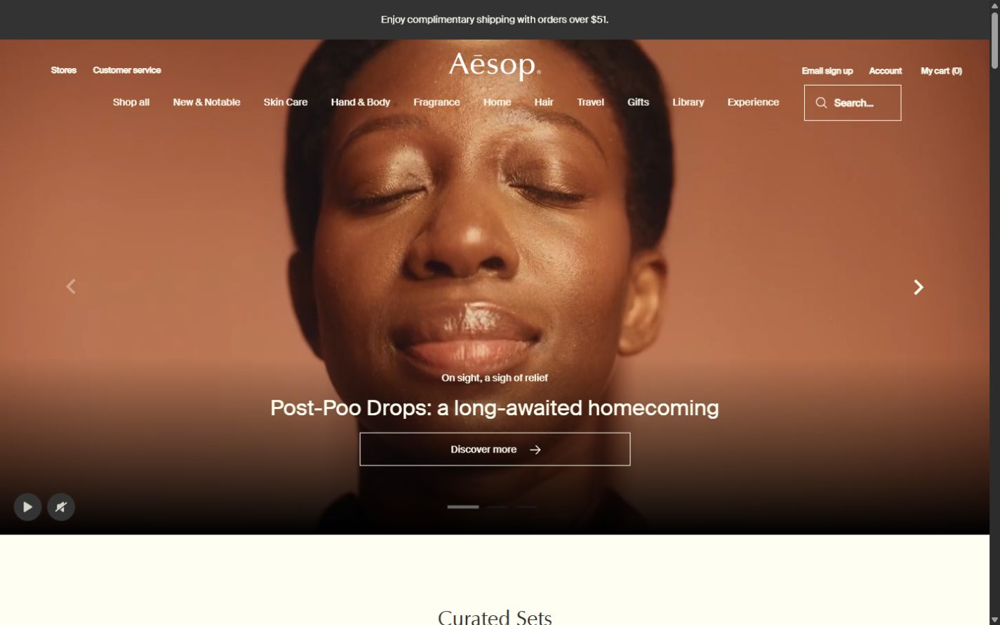
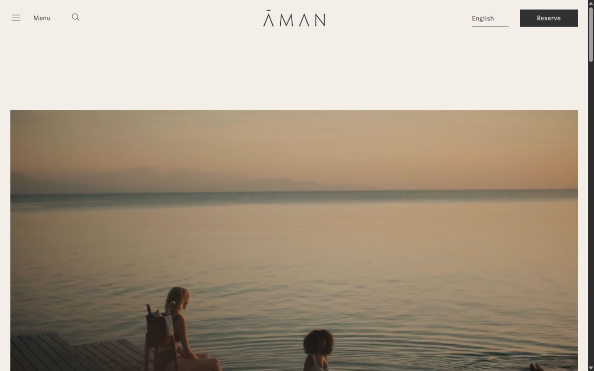
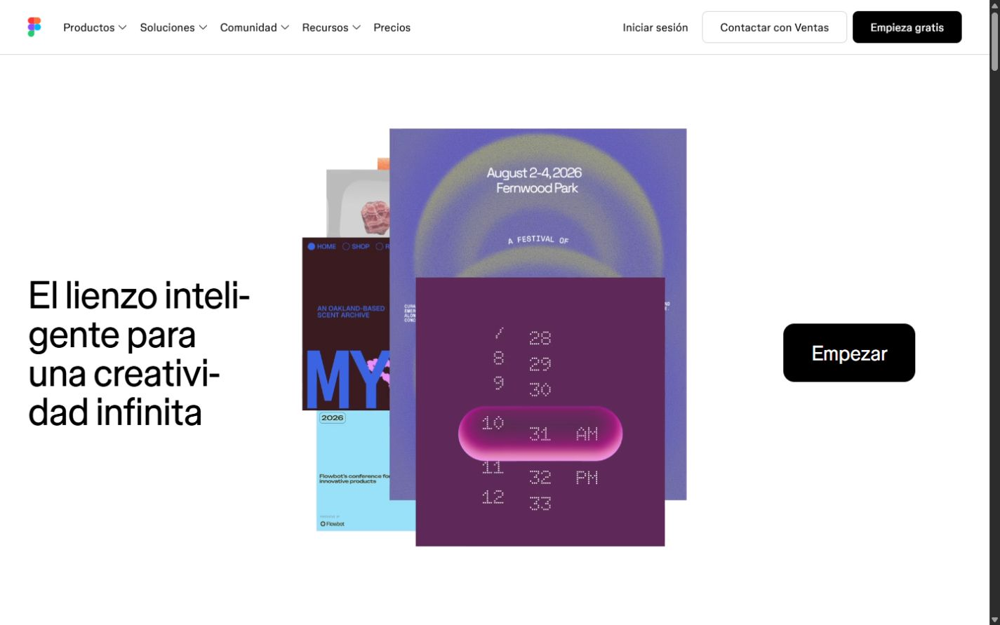
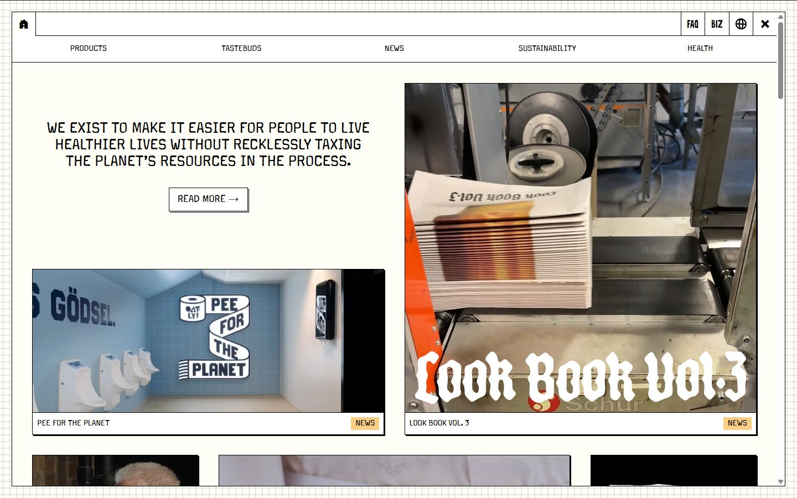
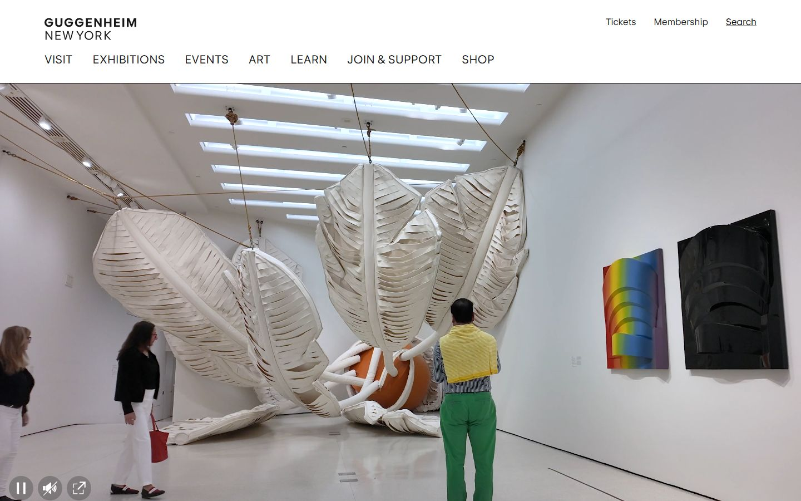

<p align="center">
  
</p>

<p align="center">
  <a href="https://github.com/luucabg/visual-web-skill/actions/workflows/verify.yml"></a>
  
  
  
</p>

<h1 align="center">De una idea a una web con criterio visual</h1>

<p align="center">
  <strong>Visual Web</strong> es una skill para Codex que estudia referencias reales, crea una dirección de arte propia, genera un diseño por sección y lo convierte en una web funcional.
</p>

## ¿Qué hace por ti?

| 1 · Encuentra | 2 · Diseña | 3 · Construye | 4 · Comprueba |
| --- | --- | --- | --- |
| Busca las referencias adecuadas para tu negocio. | Genera una propuesta original para cada sección. | Separa fotos y elementos para construirlos de verdad. | Revisa escritorio, móvil, movimiento y funciones. |

La IA **abre las capturas** antes de tomar decisiones. Cada elección queda registrada como:

> fuente → rasgo observado → adaptación propia → motivo

No entrena el modelo ni copia una web completa. Le proporciona memoria visual organizada y un método para razonar sobre ella.

## Prompt maestro para copiar y pegar

Completa lo que sepas y escribe **NO SÉ** cuando falte un dato. La IA decidirá cuántas secciones necesita la empresa, mostrará primero el mapa de la web y evitará inventar testimonios, cifras, servicios o ubicaciones. El bloque siguiente se puede copiar directamente desde este README:

<!-- PROMPT_EMPRESA_START -->

```text
Usa $visual-web para diseñar y construir una web completa para la empresa
descrita abajo. Lee todos los datos antes de tomar decisiones.

DATOS DE LA EMPRESA

- Nombre comercial: [NOMBRE]
- Qué es y qué ofrece, explicado de forma sencilla: [DESCRIPCIÓN]
- Sector: [SECTOR]
- Ubicación o zona donde trabaja: [UBICACIÓN / ONLINE / ZONAS]
- Público principal: [TIPO DE CLIENTE]
- Problema o necesidad que resuelve: [PROBLEMA]
- Servicios o productos reales: [LISTA]
- Servicio o producto prioritario: [OFERTA PRINCIPAL]
- Diferencias reales frente a otras opciones: [DIFERENCIAS]
- Proceso real de trabajo o compra: [PROCESO]
- Acción principal que queremos que haga el visitante: [PEDIR PRESUPUESTO /
  RESERVAR / COMPRAR / LLAMAR / ESCRIBIR / OTRA]
- Acción secundaria, si existe: [ACCIÓN SECUNDARIA O NO SÉ]
- Pruebas reales disponibles: [AÑOS, CIFRAS, CLIENTES, PREMIOS, RESEÑAS,
  CERTIFICACIONES O NO SÉ]
- Preguntas o dudas frecuentes de los clientes: [LISTA O NO SÉ]
- Personalidad de la marca en 3–5 palabras: [ADJETIVOS]
- Estilos que deben evitarse: [ESTILOS, COLORES O RECURSOS A EVITAR]
- Colores, tipografías o normas existentes: [DATOS O NO SÉ]
- Material disponible: [LOGO, FOTOS, VÍDEOS, TEXTOS, CATÁLOGO, CAPTURAS,
  ENLACES O NO SÉ]
- Web actual, si existe: [URL O NO SÉ]
- Referencias que le gustan a la empresa y por qué: [URL + MOTIVO O NO SÉ]
- Competidores conocidos: [URL O NOMBRES O NO SÉ]
- Idioma de la web: [IDIOMA]
- Datos de contacto autorizados: [EMAIL, TELÉFONO, DIRECCIÓN, REDES O NO SÉ]
- Restricciones legales o del sector: [RESTRICCIONES O NO SÉ]
- Tecnología o proyecto existente: [STACK / CARPETA / NO HAY PROYECTO]
- Cualquier otro dato que deba respetarse: [NOTAS]

DECISIONES QUE TE DELEGO

1. Decide tú cuántas secciones necesita la web. Usa solo las necesarias para
   explicar bien la oferta, resolver las dudas principales y conducir a la
   acción prioritaria. No fuerces ocho secciones ni una estructura genérica.
2. Antes de diseñar, presenta un mapa compacto con: nombre de sección, función,
   contenido real que utilizará, acción, recurso visual y motivo para incluirla.
3. Redacta el copy final a partir de los datos facilitados. Puedes mejorar el
   lenguaje y la jerarquía, pero no cambies hechos ni inventes afirmaciones.
4. Si falta un dato, omite la afirmación o la sección dependiente de él. No uses
   Lorem ipsum, testimonios ficticios, cifras, premios, clientes, ubicaciones,
   precios, disponibilidad ni certificaciones inventadas.
5. Si falta logo, utiliza el nombre como tratamiento tipográfico provisional;
   no inventes una identidad registrada. Si faltan fotos, usa imágenes
   conceptuales solo cuando no puedan confundirse con productos, proyectos,
   empleados o instalaciones reales.
6. Resuelve de forma autónoma las decisiones reversibles. Pregunta únicamente
   si falta un dato imprescindible que impida construir una web honesta o hacer
   funcionar la acción principal.

PROCESO VISUAL OBLIGATORIO

1. Busca en la biblioteca de $visual-web por sector, tono, fotografía,
   tipografía y tipo de conversión. Selecciona normalmente 2–4 referencias
   compatibles e incluye al menos una captura móvil.
2. Abre a tamaño legible las capturas concretas. No diseñes basándote solo en
   nombres, URLs o análisis escritos.
3. Registra las decisiones importantes como:
   fuente → rasgo observado → adaptación propia → motivo.
4. Construye una dirección de arte original conectada con el negocio. No copies
   marcas, textos, fotografías, productos ni composiciones completas.
5. Genera una imagen horizontal independiente y legible para cada sección que
   hayas decidido. Mantén una sola identidad, pero varía escala, ritmo,
   alineación y relación entre texto e imagen cuando el contenido lo pida.
6. Inspecciona todos los diseños y corrige los que sean ilegibles, incoherentes,
   repetitivos o imposibles de implementar.
7. Genera después los activos necesarios por separado, sin títulos, botones ni
   interfaz incrustada. Construye texto, botones, formularios, iconos sencillos
   y estructura como HTML/CSS/SVG accesibles.

IMPLEMENTACIÓN Y COMPROBACIÓN

- Si existe un proyecto, conserva su stack y sus componentes adecuados. Si la
  carpeta está vacía, elige una solución ligera y mantenible.
- Implementa toda la web, responsive y funcional. No uses la imagen completa de
  una sección como interfaz final.
- Todos los botones y enlaces deben tener un destino real. Si faltan datos para
  una función, no simules reservas, compras, formularios enviados o descargas.
- Usa movimiento suave con una función clara y respeta prefers-reduced-motion.
- Comprueba como mínimo un portátil pequeño y un móvil, además de teclado,
  foco, contraste, recortes, imágenes, enlaces y la acción principal.
- Compara la implementación con cada diseño generado y corrige las diferencias
  importantes de composición, tipografía, encuadre y espacio.
- Ejecuta build, lint, pruebas y verificaciones apropiadas. No declares la tarea
  terminada mientras haya secciones, estados o funciones incompletos.

ENTREGA

Entrega la web completa, sus activos, el registro de referencias y una nota
breve con: secciones elegidas, decisiones visuales, comprobaciones realizadas y
limitaciones reales. Indica con claridad cualquier dato que la empresa todavía
deba facilitar.
```

<!-- PROMPT_EMPRESA_END -->

La misma plantilla está disponible como [documento independiente](PROMPT-EMPRESA.md) para compartirla o editarla con más comodidad.

## Instalación sencilla en Windows

1. En GitHub, pulsa **Code → Download ZIP** y descomprime la carpeta.
2. Abre esa carpeta, haz clic derecho en un espacio vacío y elige **Abrir en Terminal**.
3. Copia y pega:

```powershell
powershell -ExecutionPolicy Bypass -File .\install.ps1
```

Cuando aparezca `Installed and hash-verified`, abre una tarea nueva de Codex y usa `$visual-web`. El instalador comprueba todos los archivos y conserva una copia segura si estás actualizando una versión anterior.

<details>
<summary><strong>Instalar con Git</strong></summary>

```powershell
git clone https://github.com/luucabg/visual-web-skill.git
cd visual-web-skill
.\install.ps1
```

</details>

<details>
<summary><strong>macOS o Linux</strong></summary>

Copia la carpeta `skill/visual-web` dentro de `~/.codex/skills/visual-web` y abre una tarea nueva. Las instrucciones son portables; el instalador automático incluido está pensado para PowerShell en Windows.

</details>

## Tres resultados creados con la misma skill

| ARCO · Arquitectura | PULSO · Instrumento | MESA · Talleres |
| --- | --- | --- |
| [](evaluation/architecture/review.md) | [](evaluation/instrument/review.md) | [](evaluation/school/review.md) |
| Rehabilitación calmada y material | Producto táctil y expresivo | Aprendizaje creativo y cercano |

[Ver selecciones, prompts exactos y revisiones →](evaluation/RESULTS.md)

Estos heroes son composiciones conceptuales generadas, no tres webs publicadas. En una implementación real, la skill reconstruye texto y controles en código y produce los activos necesarios por separado.

## La biblioteca visual

La biblioteca contiene **72 capturas reales** —escritorio, secciones interiores y móvil— de 18 referencias:

`Lando Norris` · `MindMarket` · `Oryzo` · `Floema` · `Mistral` · `Shopify Editions` · `Linear` · `Teenage Engineering` · `Koto` · `Locomotive` · `Basement` · `Norm Architects` · `Dropbox Brand` · `Aesop` · `Aman` · `Figma` · `Oatly` · `Guggenheim`



### Las referencias reales, a la vista

| Lando Norris | MindMarket | Oryzo |
| --- | --- | --- |
| [](skill/visual-web/references/sites/landonorris/analysis.md) | [](skill/visual-web/references/sites/mindmarket/analysis.md) | [](skill/visual-web/references/sites/oryzo/analysis.md) |

| Floema | Mistral | Shopify Editions |
| --- | --- | --- |
| [](skill/visual-web/references/sites/floema/analysis.md) | [](skill/visual-web/references/sites/mistral/analysis.md) | [](skill/visual-web/references/sites/shopify-editions/analysis.md) |

| Linear | Teenage Engineering | Koto |
| --- | --- | --- |
| [](skill/visual-web/references/sites/linear/analysis.md) | [](skill/visual-web/references/sites/teenage-engineering/analysis.md) | [](skill/visual-web/references/sites/koto/analysis.md) |

| Locomotive | Basement | Norm Architects |
| --- | --- | --- |
| [](skill/visual-web/references/sites/locomotive/analysis.md) | [](skill/visual-web/references/sites/basement/analysis.md) | [](skill/visual-web/references/sites/norm-architects/analysis.md) |

| Dropbox Brand | Aesop | Aman |
| --- | --- | --- |
| [](skill/visual-web/references/sites/dropbox-brand/analysis.md) | [](skill/visual-web/references/sites/aesop/analysis.md) | [](skill/visual-web/references/sites/aman/analysis.md) |

| Figma | Oatly | Guggenheim |
| --- | --- | --- |
| [](skill/visual-web/references/sites/figma/analysis.md) | [](skill/visual-web/references/sites/oatly/analysis.md) | [](skill/visual-web/references/sites/guggenheim/analysis.md) |

Pulsa cualquier imagen para abrir su análisis. En cada ficha hay cuatro capturas: **portada de escritorio, dos secciones interiores y portada móvil**. La IA no se limita a esta galería: la skill le obliga a buscar, abrir a tamaño legible las capturas concretas que encajan con el encargo y leer después sus análisis.

Cada web incluye:

- capturas originales y fecha de observación;
- procedencia, viewport y posición de scroll;
- análisis visual legible y datos JSON para la IA;
- decisiones transferibles, límites y rasgos que debe evitar copiar;
- estado de movimiento marcado como observado o no probado.

[Explorar las 72 capturas en el índice visual →](skill/visual-web/references/INDEX.md)

## Qué contiene

```text
visual-web-skill/
├── skill/visual-web/        ← la skill instalable
│   ├── SKILL.md             ← método principal
│   ├── agents/openai.yaml   ← presentación en Codex
│   ├── references/          ← capturas, catálogo y guías
│   └── scripts/             ← búsqueda y validación
├── evaluation/              ← tres pruebas visuales independientes
├── tests/                   ← pruebas de integridad y seguridad
├── install.ps1              ← instalación verificada por hash
└── NOTICES.md               ← procedencia y límites de uso
```

La carpeta `skill/visual-web` es autocontenida. El buscador funciona desde cualquier directorio y devuelve las imágenes concretas que la IA debe abrir.

## Para ampliar la colección

El [protocolo de captura](skill/visual-web/references/capture-protocol.md) explica cómo añadir una web sin inventar datos ni guardar pantallas de error. Después:

```powershell
node scripts/rebuild-catalog.mjs
node scripts/check-package.mjs
node skill/visual-web/scripts/validate.mjs
.\install.ps1 -Force
```

`rebuild-catalog` mide los archivos y relaciona cada captura por ID. Nunca genera observaciones visuales automáticamente.

## Verificación

```powershell
node --test tests/tooling.test.mjs tests/maintenance.test.mjs
node scripts/check-package.mjs
node scripts/check-evaluations.mjs
node scripts/check-release.mjs
```

La suite comprueba imágenes JPEG/PNG reales, rutas seguras, catálogo, búsqueda bilingüe, instalación con backup, enlaces, caso OFFGRID y las tres evaluaciones. GitHub Actions repite estas comprobaciones en cada cambio.

## Uso responsable

Las capturas muestran diseños, marcas, fotografías y textos de sus respectivos titulares. Se conservan como referencias privadas de estudio y **no son activos para copiar o reutilizar**. Los diseños nuevos deben desarrollar su propia identidad y usar contenido autorizado. Consulta [procedencia y límites](NOTICES.md) y la [licencia](LICENSE.md).

Visual Web ayuda a diseñar y verificar mejor; no garantiza premios ni sustituye contenido real, accesibilidad, buen desarrollo o revisión humana.
